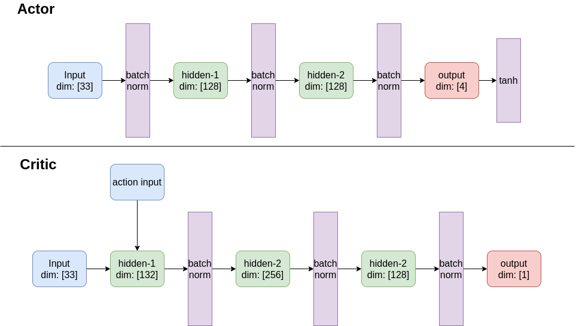
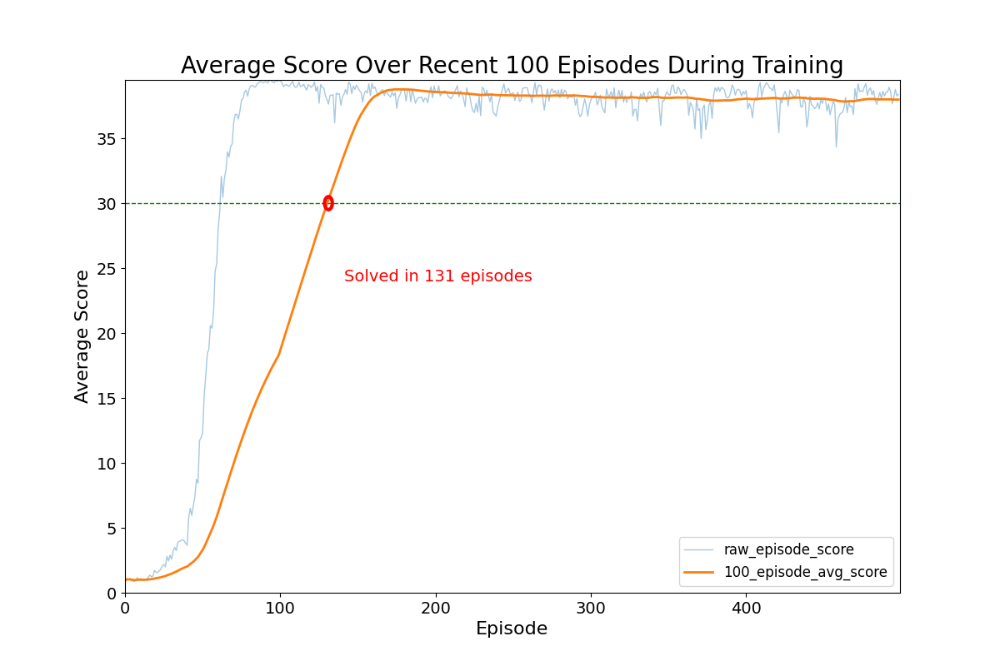

# Deep RL Continuous Control - DDPG on the Reacher Environment in Unity-ML


Project code for developing an RL agent that learns how to control a robotic arm in a virtual world. Part of my work for the Deep RL Nanodegree on Udacity.

## Author

Chris Cadonic

chriscadonic@gmail.com

## Background

**
A full report describing much of my approach, results, and potential improvements can be found in the file [docs/Report.pdf](docs/Report.pdf).**

In this project, a Unity environment that contains either a single arm, or collection of 20 arms, exist in an open world environment. Each arm can move in certain ways, specifically determined by the amount of torque
applied to each of two joints located on each arm. In the Reacher Unity environment, the agent is tasked with applying the appropriately amount of torque to these joints in order to keep an arm in a target location that moves within the 3D environment.

The state in this environment is defined by 33 `float` values that represent continuous values for position, rotation, velocity, and angular velocities of the arm. The way that an agent can apply torque to the arms' joints results in a 4-dimensional continuous action space for the two torque values that can be applied to each of the two arm joints. This is what the agent learns to apply. Lastly, the agent gains a reward of +0.01 for each step the agent's gand is in a target location.

A demonstration of the environment on an agent that has not yet learned the task is as follows:


The white arms are each controlled by one of the 20 instances of an RL agent, which is tasked to learn how to apply torque to arm joints such that the arms hand (the blue blob) remains in the moving target location (green blob).

Contrast this to an agent that has successfully learned how to apply torque to the arm joints such that they maximize the reward they receive from torque applications:


Given the amount of reward possible, the environment is considered solved when the agent is able to successfully
move the arm to stay in the target location and receive an average episode reward of +30 over 100 consecutive
episodes.

## Setup and Running

### Setup

Just as in outlined in [the DRLND repository](https://github.com/udacity/deep-reinforcement-learning#dependencies), the following steps can be used to setup the environment:

1. Setup an `anaconda` environment (optional):
```
conda create --name drlnd python=3.6
```
and then activate this environment using:
```
conda activate drlnd
```
in MacOS and Linux or
```
activate drlnd
```
in Windows.

2. As in the DRLND repository, install dependencies using:
```
git clone https://github.com/udacity/deep-reinforcement-learning.git
cd deep-reinforcement-learning/python
pip install .
```

3. Setup the Unity environment

This environment is specifically provided by Udacity to contain the learning environment. A link to a file will be added here once verified that
such a link can be provided openly.

With the Unity environment acquired, the directory structure for this project should then be:

```
configs/...
docs/...
envs/...  <-- place the unzipped Unity environment directories here
models/...
control/...  <-- main code for project
output/...
README.md
runner.py
requirements.txt
```
Main code in the `navigation` directory is organized as follows:
```
navigation/
    control_main.py       <-- code for interfacing the agents and the environment
                              and running episodes in the environment
    torch_models/
        simple_linear.py     <-- torch model for DQN using an 8-layer MLP of linear layers
```

### Running

```
python runner.py
```
from the root of this project repository. Arguments can be provided as follows:
- `-t` (or `--train`): train the model with the provided configuration file (Defaults to False),
- `-c` (or `--config`): specify the configuration to use for training the model (Defaults to `configs/default_config.yaml`.

Thus, running the model to show inference using the final trained model without visualization can be run using:
```
python runner.py
```
or with visualization using:
```
python runner.py -c configs/default_vis_config.yaml
```

The model can also be retrained if one wishes by passing the `-t` or `--train` flag. Be careful as this will overwrite any output in the `output/` directory and saved models in the `models` directory, as specified by the configuration file.

If one wishes to change parameters, then you can create a new configuration file, or modify an existing configuration file, and provide parameters in the following format:
```
# general parameters
file_path: 'envs/Reacher_Linux_Multi_NoVis/Reacher.x86_64'
model_file: 'models/multi_ddpg.pkl'
graph_file: 'training-performance.png'

###########################################################################
# valid values include 'random', 'ddpg', 'd4pg', 'ppo'
alg: 'ddpg'
###########################################################################

# parameters for printing and controlling learning time
frame_time: 0.00
max_episodes: 500
max_iterations: 100000
t_update: 1 # number of time steps to take before update
num_updates: 2 # number of network updates to complete in a time step

# model parameters
model_params:
  # training parameters
  gamma: 0.99
  actor_alpha: 0.0001
  critic_alpha: 0.0001
  t_freq: 100
  tau: 0.001

  # parameters for the Ornstein-Uhlenbeck noise process
  use_ornstein: True
  theta: 0.15
  sigma: 0.2
  mu: 0.0
  decay: 1.0  # 1.0 decay is no decay
  # general noise
  epsilon: 1.0
  epsilon_decay: 0.9999
  epsilon_min: 0.01
  noise_variance: 0.5

  # parameters for the replay buffer
  buffer_size: 1000000
  batch_size: 128

  # architecture
  actor_inter_dims: [128, 128]
  critic_inter_dims: [128, 256, 128]
  use_batch_norm: True

  # parameters specific to PPO
  eps_clip: 0.05
  variance_decay: 0.9995
```

## Results

Using the DDPG algorithm, an agent was able to train using the 20-agent version of the Reacher Unity-ML environment.
Specificially, this actor-critic Q-learning based algorithm was able to successfully solve the environment with the following architecture:



With this architectural setup, the following parameters were determined through manual optimization search or by adapting values from the original DDPG [paper by Lillicrap at al.](https://arxiv.org/abs/1509.02971), specifically regarding parameters for the Ornstein-Uhlenbeck noise process.

| Hyperparameter | utility | value |
| --- | --- | --- |
| $\alpha$ | learning rate | 0.001 |
| $\tau$ | target network soft-update rate | 0.001 |
| $\gamma$ | discount factor on future returns | 0.99 |
| $t\ update$ | number of steps to take before updating networks | 0.001 |
| $num updates$ | number of updates to complete each time networks are updated during training | 0.001 |
| $\mu$ | regression mean for Ornstein-Uhlenbeck noise | 0.001 |
| $\theta$ | factor for weighing the delta of value from mean | 0.001 |
| $\sigma$ | factor for weighting the Weiner (Gaussian) noise process | 0.001 |

With these values, the following results were acquired:



This illustrates that the agent was able to learn how to reliably control the arm and keep it within
the target location in 131 episodes of training. Results were stable, and the ceiling for performance reached
approximately ~+37 reward per episode, which remained fairly constant once a steady-state was reached. Training greatly benefitted from training on the multi-agent environment, since then a pooled experience replay enabled agents to learn from a myriad of experience tuples without having to explicitly extract that tuple from direct interaction, even though each of the 20 agents were trained independently of each other.

This result suggests that other algorithms that are able to train on multiple agents, particularly algorithms such as PPO or D4PG, may be able to achieve even better stable learning on this environment. Some may be able to better capitalize on parallelized training and possibly incur additional learning across agents through some level of interaction.
